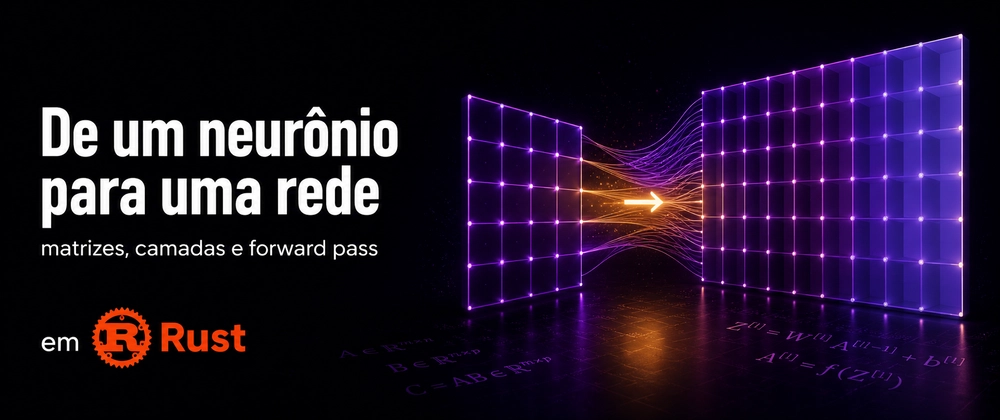

Um neurônio com uma entrada só aprende uma reta. Para modelar problemas reais precisamos de mais entradas, mais neurônios e uma forma eficiente de organizar tudo isso. Neste post vamos construir em Rust as peças que tornam uma rede neural possível: matrizes, camadas e o forward pass.

### Conteúdo

- 1 [Prólogo](#1)
- 2 [O que é uma matriz na prática](#2)
- 3 [Multiplicação matricial — o que está acontecendo](#3)
- 4 [O que é uma Layer](#4)
- 5 [Forward pass](#5)
- 6 [Conclusão](#6)

---

### 1. Prólogo <a name="1"></a>

No [projeto anterior](https://dev.to/z4nder/ia-do-zero-gradient-descent-opimizando-seu-neuronio-em-rust-34cl) tínhamos um único neurônio prevendo a distância de uma bala de canhão com um peso, uma entrada e uma saída. Simples, mas inútil para qualquer problema real.

A distância de uma bala não depende só da energia — depende do vento, do ângulo, do peso do projétil. A rede precisa aprender como cada fator influencia o resultado com um peso diferente. Quando temos múltiplas entradas, múltiplos neurônios e múltiplos exemplos ao mesmo tempo, entram as matrizes.

Antes a fórmula era `distância = w × energia + b` mas com múltiplas entradas (**features**) o modelo se expande:

```plaintext
distância = w₁×energia + w₂×vento + w₃×ângulo + b
```

Isso pode ser resumido na **notação matricial**:

```python
Y = X @ W + b
```

O `@` é multiplicação matricial. Ele faz exatamente a mesma soma ponderada de antes, mas organizada de forma que funciona para múltiplas features e múltiplos exemplos ao mesmo tempo.

---

### 2. O que é uma matriz na prática <a name="2"></a>

Uma matriz é uma tabela de números organizada em linhas e colunas.

`X` representa o dataset de entrada onde **cada linha é um exemplo e cada coluna é uma feature**. Para 2 exemplos com 3 features, `X` tem formato `(2×3)`:

```rust
let x = Matrix::new(2, 3, vec![
    10.0, 80.0, 0.30,   // exemplo 0: energia=10, vento=80, ângulo=0.30
    20.0, 60.0, 0.25,   // exemplo 1: energia=20, vento=60, ângulo=0.25
]);
```

`W` também vira uma matriz. Com 3 features e 2 neurônios na saída, `W` tem formato `(3×2)` onde **cada coluna representa um neurônio**:

```rust
let w = Matrix::new(3, 2, vec![
    0.5, 0.1,   // pesos da energia  — neurônio 1 e 2
    0.3, 0.4,   // pesos do vento    — neurônio 1 e 2
    0.2, 0.6,   // pesos do ângulo   — neurônio 1 e 2
]);
```

`b` é um `Vec<f64>` com **um valor por neurônio**. Ele não entra na multiplicação de matrizes pois é somado diretamente à saída:

```rust
let b: Vec<f64> = vec![0.2, 0.1]; // um bias por neurônio
```

---

### 3. Multiplicação matricial — o que está acontecendo <a name="3"></a>

No projeto anterior usávamos `*` para multiplicar um peso por uma entrada. O `@` faz a mesma conta para todas as features e todos os exemplos de uma vez.

Para o exemplo 0 com 1 neurônio:

```text
X[0] = [10.0, 80.0, 0.3]
W    = [0.5,  0.3,  0.2]

saída[0] = 10.0×0.5 + 80.0×0.3 + 0.3×0.2
         = 5.0 + 24.0 + 0.06
         = 29.06
```

A implementação completa fica assim:

```rust
pub fn matmul(&self, other: &Matrix) -> Matrix {
    assert_eq!(
        self.cols, other.rows,
        "dimensões incompatíveis: {}×{} · {}×{}",
        self.rows, self.cols, other.rows, other.cols
    );

    let m = self.rows;  // linhas de X  (exemplos)
    let n = other.cols; // colunas de W (neurônios)
    let k = self.cols;  // features — devem bater com linhas de W

    let mut result = Matrix::zeros(m, n);

    for i in 0..m {         // cada exemplo
        for j in 0..n {     // cada neurônio
            let mut sum = 0.0;
            for p in 0..k { // soma ponderada das features
                sum += self.get(i, p) * other.get(p, j);
            }
            result.set(i, j, sum);
        }
    }

    result
}
```

O `assert_eq!` garante que as dimensões batem antes de rodar. Se `X` tem 3 colunas, `W` precisa ter 3 linhas pois sem isso o loop produziria resultados errados silenciosamente.

---

### 4. O que é uma Layer <a name="4"></a>

Com um único neurônio: 1 peso, 1 bias, 1 saída. Ele só consegue aprender uma relação linear simples.

Uma **Layer** é um conjunto de neurônios operando juntos sobre a mesma entrada onde você define quantos neurônios quer e ela cria um `W` com uma coluna por neurônio:

```rust
pub struct Layer {
    pub w: Matrix,
    pub b: Vec<f64>,
}

// 3 features de entrada, 4 neurônios na camada
Layer::new(3, 4)
```

Os valores de `W` são inicializados **aleatórios**, não zeros. Se todos os pesos começassem iguais, todos os neurônios aprenderiam exatamente a mesma coisa e a camada inteira seria inútil.

A escala do aleatório também importa. Pesos muito grandes e os valores explodem ao passar pelas camadas. Muito pequenos e desaparecem. Para isso usamos **Xavier initialization** — o intervalo é proporcional ao número de entradas:

```rust
let scale = (1.0 / in_features as f64).sqrt(); // ≈ 0.577 para 3 features
let w_data: Vec<f64> = (0..in_features * out_features)
    .map(|_| rng.gen_range(-scale..scale))
    .collect();
```

Gerando pesos dentro de um intervalo controlado, como:

```text
W (3×4):
 -0.52,  0.18, -0.31,  0.44,
  0.57, -0.12,  0.08, -0.49,
 -0.21,  0.63, -0.55,  0.37
```

O **bias começa em zeros** — ele não tem o mesmo problema de simetria que os pesos.

---

### 5. Forward pass <a name="5"></a>

O `forward` é a função da layer que aplica `Y = X @ W + b`.

Com um único neurônio isso era `y = x * w + b`. Com vários neurônios e vários exemplos ao mesmo tempo, a mesma conta vira multiplicação matricial:

```text
X (1 exemplo, 3 features):
  [10.0, 80.0, 0.3]

W (3 features, 4 neurônios):
  [-0.41,  0.12, -0.29,  0.33]
  [ 0.51, -0.08,  0.05, -0.44]
  [-0.19,  0.55, -0.48,  0.27]

b = [0.0, 0.0, 0.0, 0.0]

y1 = 10×(-0.41) + 80×0.51  + 0.3×(-0.19) + 0  ≈  36.64
y2 = 10×0.12   + 80×(-0.08) + 0.3×0.55   + 0  ≈  -5.04
y3 = 10×(-0.29) + 80×0.05  + 0.3×(-0.48) + 0  ≈   0.96
y4 = 10×0.33   + 80×(-0.44) + 0.3×0.27   + 0  ≈ -31.82

Y = [36.64, -5.04, 0.96, -31.82]
```

Cada valor de `Y` é a saída de um neurônio da camada. A implementação:

```rust
pub fn forward(&self, input: &Matrix) -> Matrix {
    let mut out = input.matmul(&self.w); // X @ W

    for i in 0..out.rows {
        for j in 0..out.cols {
            out.set(i, j, out.get(i, j) + self.b[j]); // + b
        }
    }

    out
}
```

Chamamos isso de **forward pass** porque a informação avança pela rede da entrada até a saída. Mais tarde, durante o treinamento, faremos o caminho inverso (**backward pass**) para ajustar os pesos e reduzir o erro.

---

### 6. Conclusão <a name="6"></a>

Neste post saímos de um neurônio com uma entrada e chegamos numa camada com múltiplos neurônios recebendo múltiplas features ao mesmo tempo.

O que foi construído:

- A struct `Matrix` com multiplicação matricial e validação de dimensões
- A struct `Layer` com **Xavier initialization** e `forward`
- A struct `Dataset` com inputs e targets
- O forward pass completo com duas camadas em sequência

No próximo post: funções de ativação, backpropagation e o loop de treino que faz a rede aprender de verdade.

---

### Referências

- [Código-fonte do projeto](https://github.com/z4nder/rs-multilayer-perceptron)
- [Neural Network from Scratch — vídeo que inspirou essa série](https://www.youtube.com/watch?v=GkiITbgu0V0&t=477s)
- [Post anterior — Gradient Descent](https://dev.to/z4nder/ia-do-zero-gradient-descent-otimizando-seu-neuronio-em-rust)

---

Se este post fizer sentido pra você, o próximo passo é adicionar ativação entre as camadas e ensinar a rede a aprender com os próprios erros e isso vem no próximo post da série.
