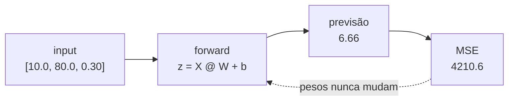
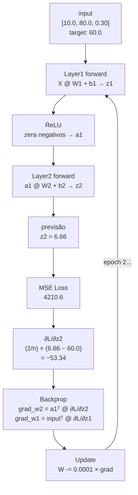

# Diagramas Mermaid do Post C

Arquivo de apoio para preservar os dois diagramas `mermaid` originais do post `post-c-training.md`.

## Loop simples sem treino

```mermaid
flowchart LR
    A["input\n[10.0, 80.0, 0.30]"] --> B["forward\nz = X @ W + b"]
    B --> C["previsão\n6.66"]
    C --> D["MSE\n4210.6"]
    D -. "pesos nunca mudam" .-> B
```

## Loop completo de treino

```mermaid
flowchart TD
    A["input\n[10.0, 80.0, 0.30]\ntarget: 60.0"] --> B["Layer1 forward\nX @ W1 + b1 → z1"]
    B --> C["ReLU\nzera negativos → a1"]
    C --> D["Layer2 forward\na1 @ W2 + b2 → z2"]
    D --> E["previsão\nz2 = 6.66"]
    E --> F["MSE Loss\n4210.6"]
    F --> G["∂L/∂z2\n(2/n) × (6.66 − 60.0)\n= −53.34"]
    G --> H["Backprop\ngrad_w2 = a1ᵀ @ ∂L/∂z2\ngrad_w1 = inputᵀ @ ∂L/∂z1"]
    H --> I["Update\nW -= 0.0001 × grad"]
    I -->|"epoch 2..." | B
```
