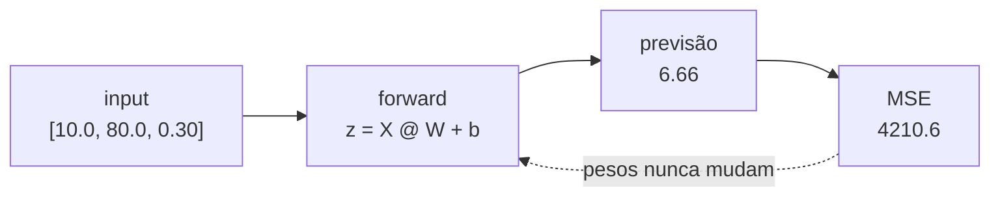
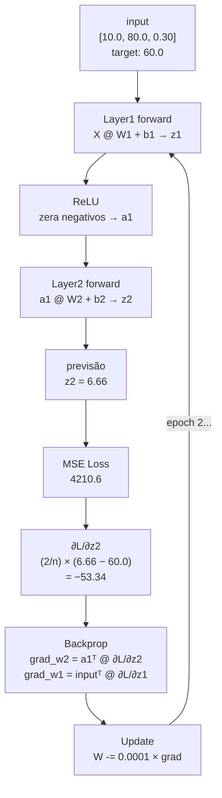

# Como ensinar uma rede neural a aprender com os próprios erros

<p align="center">
  
</p>

No [post anterior](https://dev.to/z4nder/por-que-camadas-lineares-sozinhas-nao-funcionam-e-o-que-a-relu-resolve-5f00) construímos o forward pass completo com duas camadas e ativação podendo já gerar uma previsão, mas os pesos eram aleatórios e nunca mudavam. Neste post fechamos o loop: **loss, backpropagation e gradient descent**.

### Conteúdo

- 1 [Prólogo](#1)
- 2 [A rede prevê mas não aprende](#2)
- 3 [Medindo o erro com MSE](#3)
- 4 [O gradiente da saída](#4)
- 5 [Backpropagation](#5)
- 6 [Atualizando os pesos](#6)
- 7 [O loop de treino](#7)
- 8 [Conclusão](#8)

---

### 1. Prólogo <a name="1"></a>

Nos ultimos posts trabalhamos na estrutura para implementar o **Backpropagation** que eu estava tão animado pois é um dos algoritmos mais famosos nesse ambiente de ML. Conseguimos já compreender como trabalhar com matrizes para termos camadas na rede e o papel da funcao de ativacao nesse processo mas ainda não implementamos o fluxo de treinamento, então vamos nessa, sem medo de ser feliz !

---

### 2. A rede prevê mas não aprende <a name="2"></a>

Os pesos `W` e `b` foram inicializados aleatórios e nunca mudavam com isso a rede gerava uma pervisão mas não aprendia o caminho para melhorar.

Para aprender essas três coisas precisam acontecer em sequência:

1. **Medir o erro**: o quanto a previsão se afastou do valor real - MSE
2. **Calcular os gradientes**: em qual direção ajustar cada peso para reduzir esse erro - Gradient descent
3. **Atualizar os pesos**: aplicar o ajuste em cada camada

No nosso contexto de treinamento com multiplas Layers precisamos fazer de uma forma diferente de como fazermos com somente 1 neuronio esses processo.

---

### 3. Medindo o erro com MSE <a name="3"></a>

A fórmula é a mesma que já conhecemos:

```
MSE = (1/n) × Σ (previsão - target)²
```

A diferença é que `previsão` agora é uma `Matrix (n×1)`, uma linha por exemplo do batch:

```rust
pub fn mse(predictions: &Matrix, targets: &[f64]) -> f64 {
    let n = targets.len() as f64;
    let sum: f64 = (0..targets.len())
        .map(|i| {
            let diff = predictions.get(i, 0) - targets[i];
            diff * diff
        })
        .sum();
    sum / n
}
```

Com os nossos 2 exemplos antes de qualquer treino:

```text
previsões: [6.66, 5.30]
targets:   [60.0, 80.0]

erro[0] = (6.66  - 60.0)² = 2840.7
erro[1] = (5.30  - 80.0)² = 5580.5

MSE = (2840.7 + 5580.5) / 2 = 4210.6
```

Loss alto é esperado e os pesos ainda são aleatórios então o nosso objetivo é fazer esse número cair.

---

### 4. O gradiente da saída <a name="4"></a>

O MSE nos dá 1 número para monitora o treino, mas para **ajustar os pesos** precisamos de algo mais específico: o quanto cada previsão individualmente precisa mudar, e em qual direção.

Isso vem da derivada do MSE em relação à **saída da última camada**.

No nosso caso `∂MSE/∂z2` com 2 layers a última saída é `z2` que é o resultado de `a1 @ W2 + b2`, sem aplicar nenhuma ativação. Essa saída bruta **é a previsão final da rede**

A camada de saída não tem **ReLU** porque a rede precisa poder prever qualquer número: com ReLU ela nunca preveria valores negativos.

O gradiente dessa saída é

```
∂MSE/∂z2 = (2/n) × (z2 - target)
```

O resultado é uma **matriz (n×1)**, um valor por exemplo:

```text
z2      = [ 0.527]     targets = [60.0]
          [-1.011]               [80.0]

∂L/∂z2 = (2/2) × (z2 - targets)
        = [-59.473]
          [-81.011]
```

Cada valor diz quanto e em qual direção a previsão precisa mudar que é o papel do **gradient descent**. É o sinal que inicia o **backpropagation**.

> **O MSE monitora. O gradiente do MSE guia.**

```rust
pub fn mse_grad(predictions: &Matrix, targets: &[f64]) -> Matrix {
    let n = targets.len() as f64;
    let data: Vec<f64> = (0..targets.len())
        .map(|i| (2.0 / n) * (predictions.get(i, 0) - targets[i]))
        .collect();
    Matrix::new(targets.len(), 1, data)
}
```

---

### 5. Backpropagation <a name="5"></a>

Backpropagation **calcula os gradientes**, quanto cada peso contribuiu para o erro. Quem usa esses gradientes para ajustar os pesos é o **gradient descent**, que vem depois. São dois papéis separados que acontecem em sequência.

O forward que é o primeiro treino iniciado com valores aleatorios, precisa guardar os valores intermediários porque o backprop vai percorrer o mesmo caminho ao contrário:

```
forward:  guarda →  z1, a1, z2  (previsão com os pesos atuais)
backprop: usa    ←  z2, a1, z1  (percorre de trás pra frente)
```

O fluxo completo de gradientes por camada:

```
∂L/∂z2                        ← gradiente da saída (mse_grad)
∂L/∂W2 = a1.T @ ∂L/∂z2       ← gradiente de W2
∂L/∂b2 = soma(∂L/∂z2)         ← gradiente de b2
∂L/∂a1 = ∂L/∂z2 @ W2.T       ← propaga pela Layer2 (transposta)
∂L/∂z1 = ∂L/∂a1 × relu'(z1)  ← propaga pelo ReLU
∂L/∂W1 = input.T @ ∂L/∂z1    ← gradiente de W1
∂L/∂b1 = soma(∂L/∂z1)         ← gradiente de b1
```

A transposta aparece em dois lugares e vale explicar o porquê.

No forward, a multiplicação foi `a1 @ W2`: `a1` tem formato `(n × 4)` e `W2` tem formato `(4 × 1)`. Para calcular o gradiente de W2, precisamos de uma operação que resulte em `(4 × 1)`, o mesmo formato de W2. Fazendo `a1.T @ ∂L/∂z2`, ou seja `(4 × n) @ (n × 1)`, chegamos exatamente em `(4 × 1)`. A transposta é o que acerta os formatos para a multiplicação funcionar na direção inversa.

O mesmo raciocínio vale para propagar o sinal de volta para a camada 1: no forward foi `∂L/∂z2 @ W2`, então no backward é `∂L/∂z2 @ W2.T` para os formatos baterem e o sinal chegar em `a1` com o formato certo.

O `relu_grad` zera o gradiente onde `z1` era negativo, porque o neurônio estava desligado no forward e não contribuiu para o erro:

```rust
pub fn backward(input: &Matrix, z1: &Matrix, a1: &Matrix, w2: &Matrix, grad_z2: &Matrix) -> Gradients {
    let grad_w2 = a1.transpose().matmul(grad_z2);
    let grad_b2 = col_sum(grad_z2);

    let grad_a1 = grad_z2.matmul(&w2.transpose());
    let grad_z1 = relu_grad(&grad_a1, z1);  // zera onde z1 era negativo

    let grad_w1 = input.transpose().matmul(&grad_z1);
    let grad_b1 = col_sum(&grad_z1);

    Gradients { grad_w1, grad_b1, grad_w2, grad_b2 }
}
```

> **Neurônio desligado no forward não recebe ajuste no backward.**

---

### 6. Atualizando os pesos <a name="6"></a>

Com os gradientes calculados, o update é simples: andar na direção oposta ao gradiente, em todas as camadas, elemento a elemento.

```
W = W - lr × ∂L/∂W
b = b - lr × ∂L/∂b
```

```rust
// Layer 2
for i in 0..camada2.w.rows {
    for j in 0..camada2.w.cols {
        let grad = grads.grad_w2.get(i, j);
        camada2.w.set(i, j, camada2.w.get(i, j) - lr * grad);
    }
}
for j in 0..camada2.b.len() {
    camada2.b[j] -= lr * grads.grad_b2[j];
}

// Layer 1
for i in 0..camada1.w.rows {
    for j in 0..camada1.w.cols {
        let grad = grads.grad_w1.get(i, j);
        camada1.w.set(i, j, camada1.w.get(i, j) - lr * grad);
    }
}
for j in 0..camada1.b.len() {
    camada1.b[j] -= lr * grads.grad_b1[j];
}
```

O sinal de menos é o que faz o peso andar na direção que reduz o loss. O `lr` (learning rate) controla o tamanho do passo.

---

### 7. O loop de treino <a name="7"></a>



Agora o loop fecha de verdade. Os valores abaixo são da epoch 0, antes de qualquer ajuste:



O loop completo por epoch:

```rust
for epoch in 0..epochs {
    // 1. forward
    let z1 = camada1.forward(&dataset.inputs);
    let a1 = relu(&z1);
    let z2 = camada2.forward(&a1);

    // 2. loss
    let loss = mse(&z2, &dataset.targets);

    // 3. backprop
    let grad_z2 = mse_grad(&z2, &dataset.targets);
    let grads = backward(&dataset.inputs, &z1, &a1, &camada2.w, &grad_z2);

    // 4. update
    // ... atualiza W2, b2, W1, b1
}
```

Repete por N epochs. A cada iteração os pesos se aproximam dos valores que minimizam o loss.

#### O que o gráfico mostra


**0–50 epochs:** queda brusca, os pesos saem do aleatório e encontram uma direção clara. O gradiente é grande porque o erro é enorme, os passos são grandes.

**50–300 epochs:** oscilações, a rede está refinando mas ainda não encontrou um caminho estável. O gradiente varia bastante de epoch para epoch porque os exemplos puxam os pesos em direções ligeiramente diferentes.

**300–1000 epochs:** estabilização, as oscilações somem e o loss converge suavemente. Com mais exemplos o gradiente vira uma média de mais pontos a cada epoch, o que suaviza o sinal e permite uma descida mais consistente.


O erro cai de ~54 e ~75 para ~4 e ~4

---

### 8. Conclusão <a name="8"></a>

Bbackprop e gradient descent são coisas diferentes que trabalham juntas. Backprop percorre a rede de trás pra frente calculando quanto cada peso contribuiu pro erro. Gradient descent usa esse resultado para dar um passo na direção certa. A separação faz sentido porque o mesmo gradiente poderia ser usado por estratégias de update diferentes.

Uma limitação que fica clara ao olhar o `backward.rs`: cada linha foi calculada à mão para essa arquitetura específica de 2 camadas com ReLU no meio.

```rust
// essas fórmulas foram derivadas para: input → Layer1 → ReLU → Layer2 → saída
let grad_w2 = a1.transpose().matmul(grad_z2);
let grad_a1 = grad_z2.matmul(&w2.transpose());
let grad_z1 = relu_grad(&grad_a1, z1);
let grad_w1 = input.transpose().matmul(&grad_z1);
```

Se quiséssemos adicionar uma terceira camada, ou trocar o ReLU por uma função de ativação diferente, precisaríamos abrir o `backward.rs`, derivar os gradientes para a nova arquitetura e reescrever as fórmulas. A estrutura não é reutilizável.

O **Micrograd do Karpathy** resolve isso de outra forma, em vez de calcular as derivadas uma vez para uma arquitetura fixa, cada operação (`+`, `*`, `@`) traz regra de como calcular seu próprio gradiente. No forward, a rede monta um grafo de operações. No backward, percorre esse grafo automaticamente, aplicando cada regra em sequência, independente de quantas camadas ou funções de ativação existam.

O resultado é o mesmo, os gradientes corretos para cada peso. A diferença é que não é mais preciso escrever `backward.rs` na mão para cada arquitetura que se queira testar.

Resolver isso pode ser o projeto seguinte **autograd**.

### Referências

- [Código-fonte do projeto](https://github.com/z4nder/rs-multilayer-perceptron)
- [Neural Network from Scratch](https://www.youtube.com/watch?v=GkiITbgu0V0&t=477s)
- [Post anterior — Por que camadas lineares sozinhas não funcionam](https://dev.to/z4nder/por-que-camadas-lineares-sozinhas-nao-funcionam-e-o-que-a-relu-resolve-5f00)

---

Se este post fizer sentido pra você, o próximo passo é eliminar a necessidade de escrever backprop à mão para cada arquitetura, construindo um sistema de autograd.
